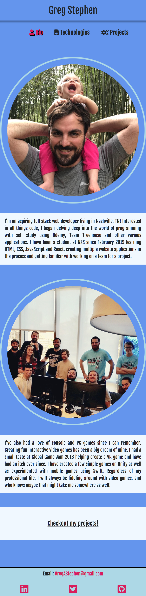

# Personal Bio Site

## Descripton:
#### A site that showcases my coding projects as well as says a little bit about myself

## Screenshots
#### Bio page:

#### Mobile bio page:

#### Projects page:

#### Mobile projects page:

## Technologies Used: 
* HTML5
* CSS
* JavaScript
* Flexbox

## How to run:

1. Go to: `https://www.npmjs.com/package/http-server` and install "http-server".  
2. Navigate to the project folder in command line interface and type: `http-server -p 8080`  
3. This will show at: `http://localhost:8080` in your internet browser.  